**Thank you to our 2022 GHC Open Source Day Committees!**

## Co-Chairs

| [Ambika Sharma](https://www.linkedin.com/in/ambika-sharma/) | [Anna Jung](https://www.linkedin.com/in/antheajung/) | [Shagun Bose](https://www.linkedin.com/in/shagunbose/) |
| --- | --- | --- |
| 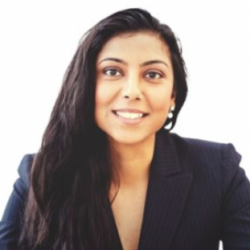 | 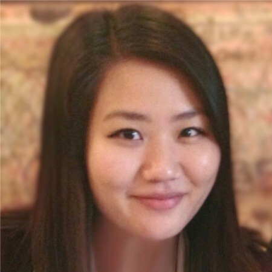 | 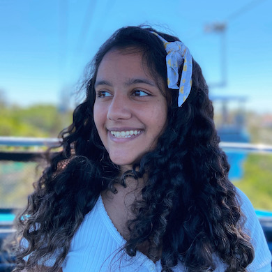

## Committee Members

| [Annu Joshi](https://www.linkedin.com/in/annu-joshi/) | [Basak Scott](https://www.linkedin.com/in/basakkilicscott/) | [Carinne Johnson](https://www.linkedin.com/in/carinnejohnson/) |
| --- | --- | --- |
| 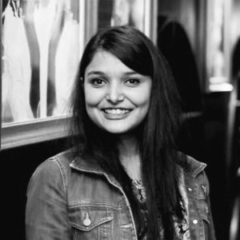 | 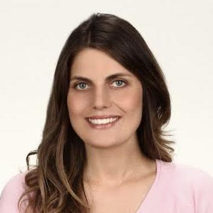 | 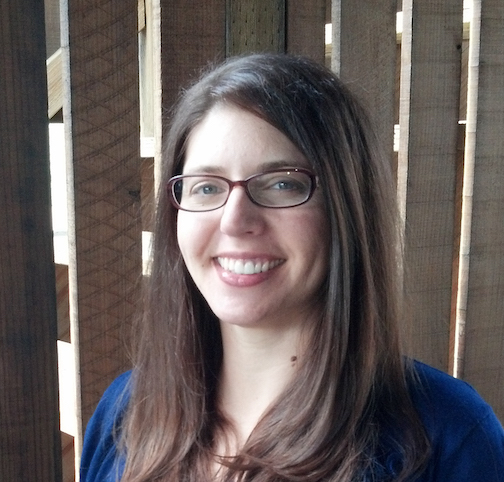 |

| [Chris Miyachi](https://www.linkedin.com/in/chris-miyachi-a31835/) | [Emily Hoang](https://www.linkedin.com/in/emily-hoang-865b40102/) | [Joy Joel](https://www.linkedin.com/in/joyjoel/) |
| --- | --- | --- |
| 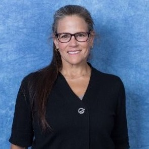 | 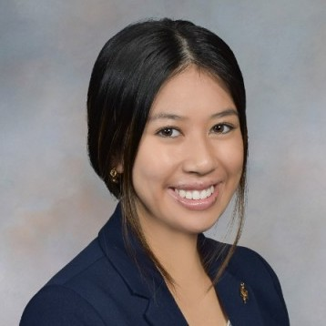 | 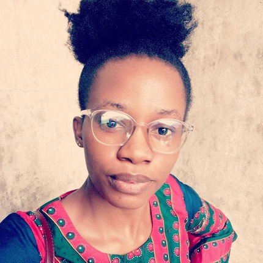 |

| [Lucy Shen](https://www.linkedin.com/in/lucyjshen/) | [Monica Miyasato](https://www.linkedin.com/in/monicamiyasato/) | [Paula Paul](https://www.linkedin.com/in/paulapaul/) |
| --- | --- | --- |
| 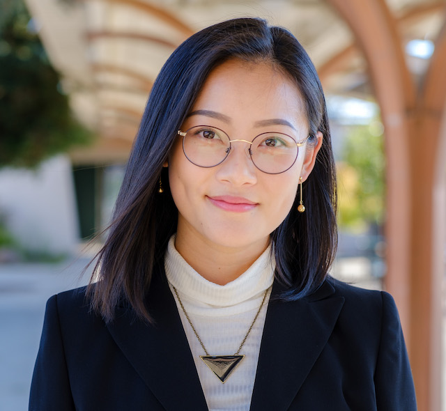 | 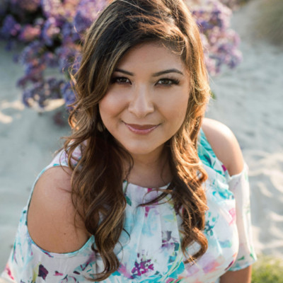 | 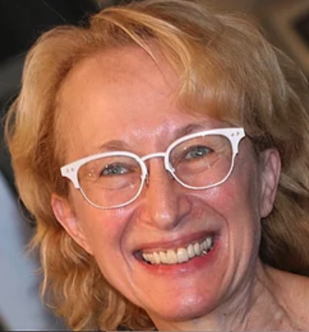 |

| [Phylis Atieno](https://www.linkedin.com/in/phyllis-atieno-ab7826182/) | [Prachi Sharma](https://www.linkedin.com/in/prachi94/) | Rasa Raghavan |
| --- | --- | --- |
| 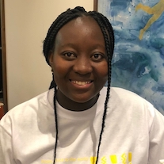 | 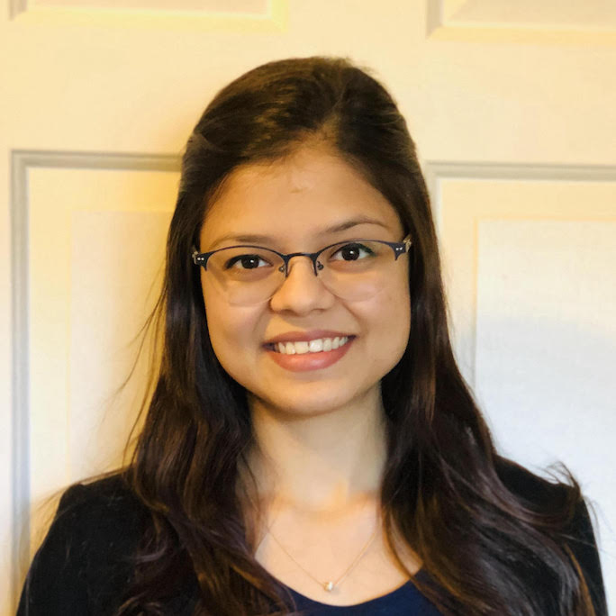 | 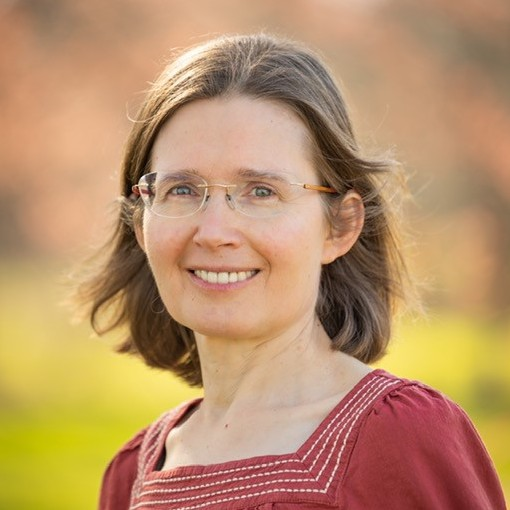 |

| [Rashan Smith](https://www.linkedin.com/in/rashansmith/) | [Sandy Skipper](https://www.linkedin.com/in/sandraskipper/) |
| --- | --- |
|  | 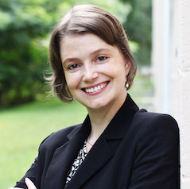  |

<!-- ## Volunteer

> Thank you for your interest! We're no longer accepting applications at this time.

Grace Hopper Celebration Open Source Day team is looking for volunteers to help organize the event for 2022. As an OSD committee member, you are responsible for leading and being accountable for the event's success. OSD committee tasks are split between several areas of responsibility:

- **Project**: Responsible for recruiting open source projects and coordinating with project partners to ensure preparation for the event.
- **Mentor**: Responsible for recruiting mentors for partner projects, training mentors, and coordinating with mentors to ensure preparation for the event.
- **Workshop**: Responsible for selecting content from reviewed CFPs, recruiting speakers, and coordinating with workshop speakers to ensure preparation for the event.
- **Communication**: Responsible for creating social media campaigns / website content and assisting with external communication for OSD.

[Apply now](https://bit.ly/OSD-volunteer) to be part of Open Source Day Committee!

 -->